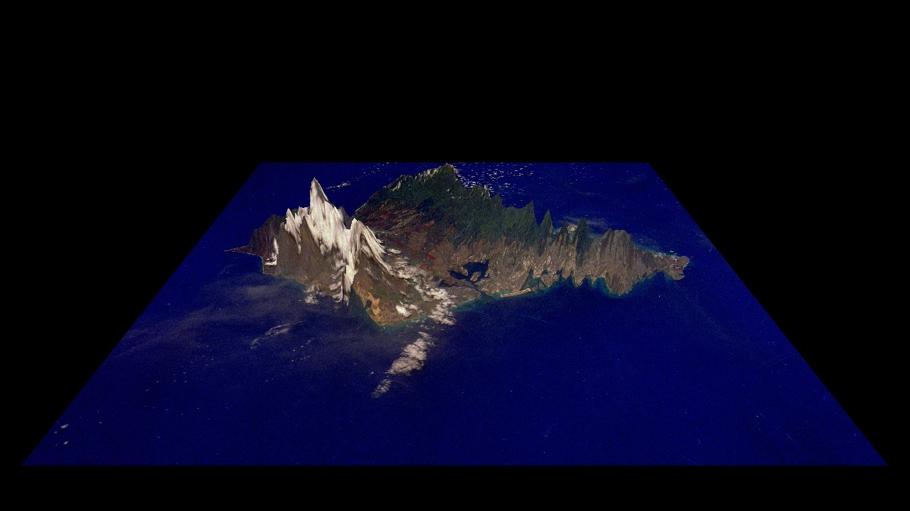
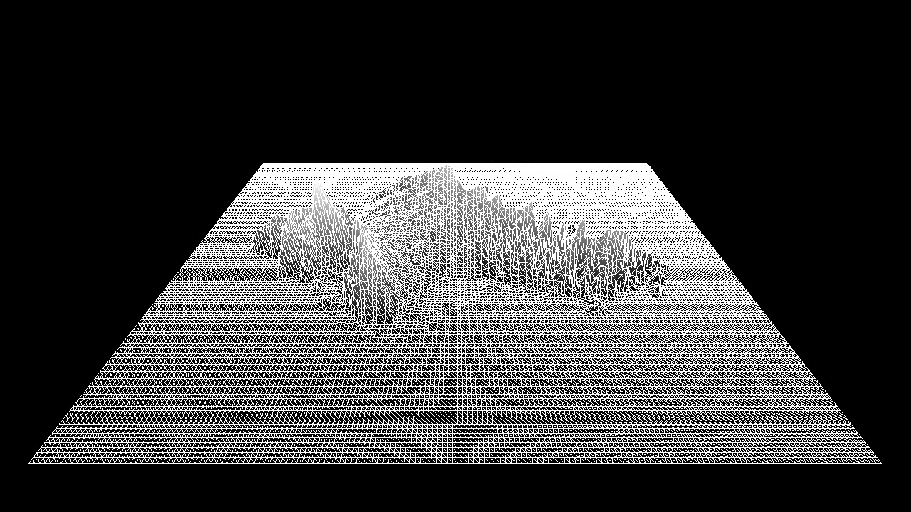
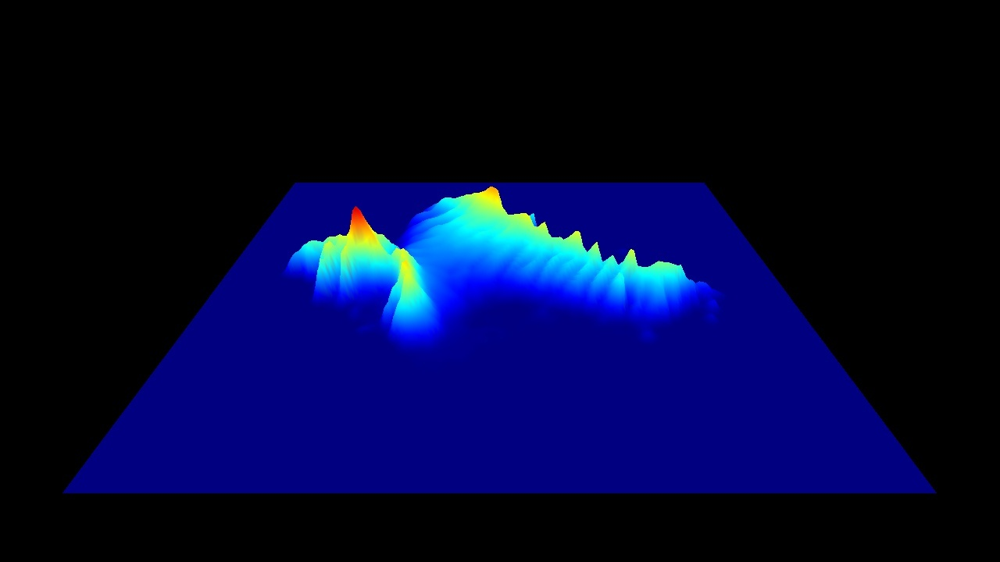
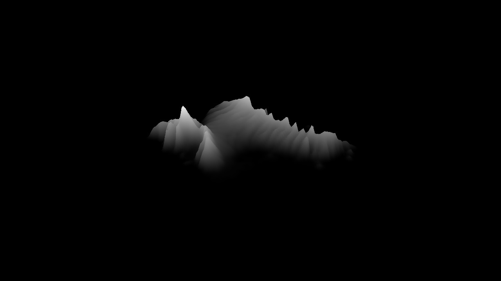
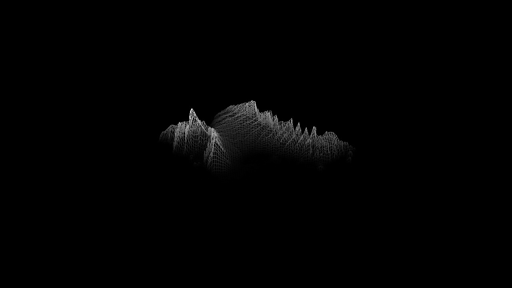
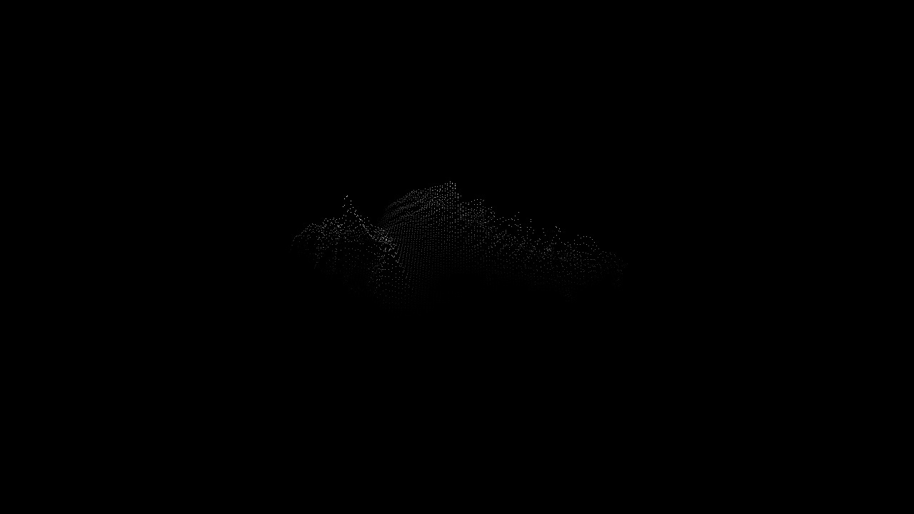

# Height Fields Using Shaders

## Description

Using OpenGL core profile, this project involves rendering a height field from an image, implementing transformations (translate/rotate/scale), writing a vertex shader for smoothing and color adjustment, and creating an animation.

## Features

- Points/lines/triangles mode.
- Smooth triangle mode
- Scale and exponentiate the height.
- Scale, translate and rotate the heightfield.    
- Use element arrays and glDrawElements to save the memory.
- Wireframe on top of solid triangles (use glPolygonOffset to avoid z-buffer fighting).
- Color the vertices based on color values taken from another image of equal size (The color of the pixel in heightfield is the same pixel in the heightmap).
- Texturemap the surface with an arbitrary image.
- Color the surface using the JetColorMap function, in the vertex shader.
- Moving the camera position and change the focus vector.

## Results

Color mode

Wire frame mode

Jet color map mode

Triangle mode

Line mode

Point mode

## Keyboard/Mouse controls

- **Points Mode**: Press `1`
- **Lines Mode**: Press `2`
- **Triangles Mode**: Press `3`
- **Smooth Mode**: Press `4`. In this mode:
  - Press `+` to multiply "scale" by 2x
  - Press `-` to divide "scale" by 2x
  - Press `9` to multiply "exponent" by 2x
  - Press `0` to divide "exponent" by 2x

**Rotation**
- X and Y axes: Press and hold left mouse button and move the mouse.
- Z axis: Press and hold middle mouse button and move the mouse.

**Scaling**
- X and Y axes: Press and hold `Shift` + left mouse button and move.
- Z axis: Press and hold `Shift` + middle mouse button and move.

**Translation (Windows)**
- X and Y axes: Press and hold `Control` + left mouse button and move.
- Z axis: Press and hold `Control` + middle mouse button and move.

**Translation (MacOS)**
Press `t` to enable\disable the Translate mode
- X and Y axes: In translation mode, press and hold left mouse button and move.
- Z axis: In translation mode, press and hold middle mouse button and move.

- **Smooth Mode With JetColorMap**: Press `5`
- **Triangles Mode with wireframe**: Press `6`
- **Texturemap the surface with an arbitrary image (If compatible)**: Press `7`
- **Texturemap the surface with an image with image at same size (If compatible)**: Press `&` (which is `shift`+`7`)
- **Reset the heightmap to initial view(Undo all the rotation, scaling and translation)**: Press `c`
- **Enable moving camera**: Press `v` to enable\disable. In this mode:
  - `w` to move the camera position ahead.
  - `s` to move the camera position backward.
  - `a` to move the camera position left.
  - `d` to move the camera position right.
  - Move the mouse to change the direction of the mouse (Look up, down, left, right).

## To run the program

### MacOS

For compile, enter the hw1 folder and make

    // Enter hw1
    cd hw1

    // make the file
    make

For only heightmap, execute

    ./hw1 <heightmap_file>

For heightmap and enable texture mapping, execute

    ./hw1 <heightmap_file> <texturemap_file>

The heightmap_file should be only grayscale or RGB image and texturemap_file should be only RGB image.

Examples

    ./hw1 heightmap/Heightmap.jpg

    ./hw1 heightmap/color.jpg

    ./hw1 heightmap/Heightmap.jpg heightmap/Heightmap.jpg/color.jpg
    
    // Mount Fuji Fuji-0001 to Fuji-0009 in Examples
    ./hw1 heightmap/mtFujiHeight-128.jpg heightmap/mtFujiHeight-1000.jpg
    // Oahu Island Oahu-0001 to Oahu-0009 in Examples  
    ./hw1 heightmap/Oahu-160x128.jpg heightmap/Oahu.jpg

### Windows

For windows, just open the hw1.sln with visual studio, and change the command arguments for custom input:

    ./heightmap/Oahu-160x128.jpg ./heightmap/Oahu.jpg

Also you can just use the command prompt (cmd.exe), such as:

    hw1\Bin\Release\hw1 hw1\heightmap\Oahu-160x128.jpg hw1\heightmap\Oahu.jpg

## Main Files Description
 - README.md - Introduction of the project
 - animations - Restore the JPEG frames required for animation
 - openGLHelper - Helper files for OpenGL
 - Examples - Example output for the heightfield
 - hw1\heightmap - File for the input images
 - hw1\hw1.cpp - Main opengl program for this homework
 - hw1\Makefile - Make file for MacOS and Linux.
 - hw1\hw1 - Compiled executable for MacOS
 - hw1\Bin\Release\hw1.exe - Compiled executable for Windows

